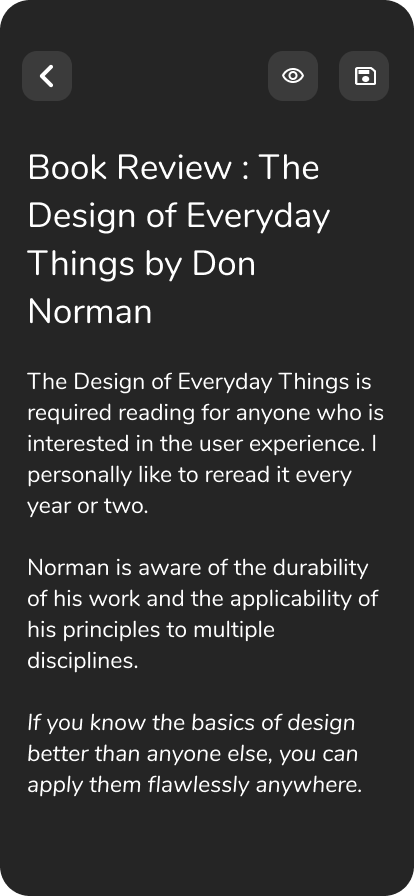

# Notes App Mobile

A beautiful, feature-rich notes application built with React Native and Expo. This app allows users to create, edit, and manage notes with a clean, modern interface.

## Screenshots

<p align="center">
  
  
  
  
</p>

## Features

- **📝 Create & Edit Notes**: Rich text editing experience with a custom toolbar for formatting (Bold, Italic, Lists, etc.).
- **💾 Local Persistence**: All notes are securely stored locally using SQLite, ensuring your data is always available offline.
- **🔍 Search**: Quickly find your notes with real-time search functionality.
- **🎨 Modern UI**: Built with NativeWind (Tailwind CSS) for a sleek, responsive design that supports Dark Mode.
- **🔤 Custom Typography**: Uses the Nunito font family for a pleasant reading experience.
- **🗑️ Management**: Easy deletion of notes with confirmation dialogs.

## Tech Stack

- **Framework**: [React Native](https://reactnative.dev/) with [Expo](https://expo.dev/)
- **Language**: [TypeScript](https://www.typescriptlang.org/)
- **Styling**: [NativeWind](https://www.nativewind.dev/) (Tailwind CSS)
- **Database**: [Expo SQLite](https://docs.expo.dev/versions/latest/sdk/sqlite/)
- **Navigation**: [Expo Router](https://docs.expo.dev/router/introduction/)
- **Icons**: [Expo Vector Icons](https://icons.expo.fyi/)

## Get Started

1. **Clone the repository**

   ```bash
   git clone <repository-url>
   cd notes-app-mobile
   ```

2. **Install dependencies**

   ```bash
   npm install
   ```

3. **Start the app**

   ```bash
   npx expo start
   ```

   In the output, you'll find options to open the app in a:

   - [Development build](https://docs.expo.dev/develop/development-builds/introduction/)
   - [Android emulator](https://docs.expo.dev/workflow/android-studio-emulator/)
   - [iOS simulator](https://docs.expo.dev/workflow/ios-simulator/)
   - [Expo Go](https://expo.dev/go)

## Project Structure

```
notes-app-mobile/
├── app/                 # Expo Router screens and layout
│   ├── index.tsx       # Home screen
│   ├── note.tsx        # Note editor screen
│   └── _layout.tsx     # Root layout & providers
├── components/          # Reusable UI components
│   ├── NoteCard.tsx
│   ├── SearchBar.tsx
│   ├── EditorToolbar.tsx
│   └── ...
├── context/             # React Context (State Management)
├── services/            # Database services (SQLite)
└── assets/              # Images and fonts
```
